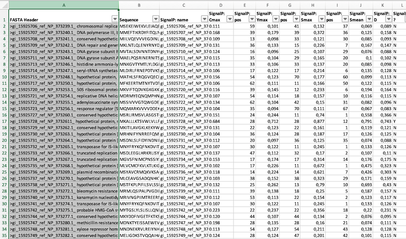
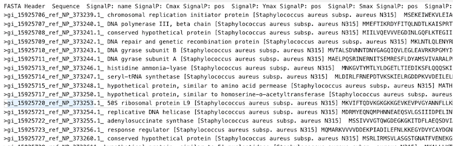
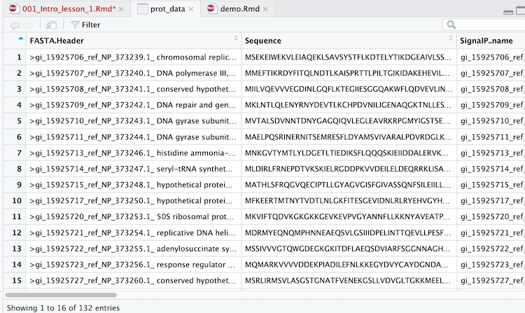

```{r setup, cache = F, echo = F, message = F, warning = F, tidy = F}
source("rmarkdown_knitr_header.R")
```

```{r echo = F}
par(mar=c(4, 4, 0, 0))
```

## Contents

- Lesson goals
- Why R?
- RStudio
- R as a calculator
- 

# GOALS

## Goals

The objectives of these two lessons are  

- demystify the concept of programming
- show why programming can be better than Excel (or SPSS)
- give you a friendly intro on programming with R

# WHY R?

## The analytical toolbox

Many tools are used in the life sciences to perform data analysis and visualisation tasks.  

The most well-known one is Excel, but you may have encountered SPSS.  

Another much-used tool is R, a programming language with embedded statistics and graphics support.  

## What is R?  

Besides its free nature, R is very popular because it  

- has an interactive mode (read–evaluate–print loop: REPL)
- makes repeating analyses (with new data) very easy
- supports "literate programming" for creating presentations (such as this one!) and reports

# RSTUDIO


## The workbench


## Panels of the workbench

You work with 4 panels in the workbench:

1. **Code editor** where you write your scripts: text file with code you want to execute more than once
2. **R console** where you execute lines of code one by one
3. **Workspace and history** See what data you have in memory, and what you have done so far
4. **Plots, Help & Files** ...


## The console vs code editor

- Use the console to do basic calculations, try pieces of code.

- Use the code editor to work on
    - **_scripts_** - analyses you may want to repeat or develop further. 
    - data files
    - analytical notebooks (RMarkdown)

# USING THE CONSOLE

## Let's calculate

R, like any programming language, supports all math operations in the way you would expect them:  

`+` &nbsp;&nbsp;&nbsp;&nbsp;is 'plus', as in `2 + 2 = 4`  

`-`&nbsp;&nbsp;&nbsp;&nbsp; ditto, subtract, as in `2 - 2 = 0`  

`*`&nbsp;&nbsp;&nbsp;&nbsp; multiply  

`/`&nbsp;&nbsp;&nbsp;&nbsp; divide  

`^`&nbsp;&nbsp;&nbsp;&nbsp; exponent (identical to: `**`)

Remember that $\sqrt{n} = n^{0.5}$  

Use parentheses `()` for grouping parts of equations.

## Precedence

All "operators" adhere to the standard mathematrical **precedence** rules (PEMDAS):

```
    Parentheses (simplify inside these)
    Exponents
    Multiplication and Division (from left to right)
    Addition and Subtraction (from left to right)
```

## --Practice 1--

In the console, calculate the following:

$31 + 11$  

$66 - 24$  

$\frac{126}{3}$  

$12^2$   

$\sqrt{256}$  

$\frac{3*(4+\sqrt{8})}{5^3}$

## Solutions

$31 + 11 = 42$  

$66 - 24 = 42$  

$\frac{126}{3} = 42$  

$12^2 = 144$   

$\sqrt{256} = 16$  

$\frac{3 * (4 + \sqrt{8})}{5^3} = 0.1638823$ -- in R: `(3 * (4 + 8^0.5))/5^3`

# DATA TYPES

## Four types of data

You have seen that R works with numbers. There are a few more types of data:

**numeric**:&nbsp; numbers with a decimal part:  
    - `3.123` & `5000.0` & `4.1E3`  
**integer**:&nbsp; numbers without a decimal part:  
    - `1` & `0` & `2999`  
**logical**:&nbsp; also called boolean values:  
    - `true` or `false`  
**character**:&nbsp; text, always between quotes:  
    - `"hello R"` or `"GATC"`  
**factor**:&nbsp; nominal and ordinal scales (visited later)  

**Note** When you type a number in the console it will always be `numeric` if it is without decimal part.   


# FUNCTIONS

## Definition

Simple mathematics is not the core business of R.  

You want to do more complex things and this is where functions come in.  

**_A function is a named piece of functionality that you can execute by typing its name, followed by a pair of parentheses. Within these parentheses, you can pass data for the function to work on. Functions may or may not return a value_**

It has this general form:
$$function\_name(argument, argument, ...)$$

## Example: Square root with `sqrt()`

You have already seen that the square root can be calculated as $n^{0.5}$.  

However, there is also a function for it: `sqrt()`. It **_returns_** the square root of the given number, _e.g._ `sqrt(36)` 

```{r}
sqrt(36)
36^0.5
```

## Another example: `paste()`  

The `paste` function can take any number of arguments and returns them, combined into a single text. You can also supply a separator using `sep=<separator string>`:


```{r}
paste(1, 2, 3, sep="---")
```

The quotes around the three dashes`"---"` indicate it is text data.

## Getting help on a function

Type `?function_name` in the console to get help on a function.  
For instance, typing `?sqrt` will give the help page of the square root function.  

Scroll down in the help page to see example usages of the function.

## --Practice 2--

1. View the help page for `paste`. There are two variants of this function.  
    - Which?  
    - What is the difference between them?
    - Use both variants to generate exactly this message `"welcome to R"` from these arguments: `"welcome", "to", "R"`
2. What does the `abs` function do?  
    - What is returned by `abs(-20)` and what is `abs(20)`?  
3. What does the `c` function do?  
    - What is the difference in its result when you combine `1`, `3` and `"a"` as arguments, or `1`, `2` and `3`? 

# VARIABLES

## What are variables?

- Variables are used to name and reuse pieces of data
- E.g., `x <- 42` is used to create a variable `x` with a value of `42`. 
- Variables are really _variable_ - their value can change!
- You define a variable using `<-` in R, so `x <- 42` is the same as `x = 42`
- The next chunk creates a variable called dna and then uses it in `paste()`:

```{r first_variable}
dna <- 'GATC'
paste("The DNA letters are:", dna)
```


## --Practice 3--

Create these three variabless: x=20, y=10 and z=3.  
Next, calculate the following with these variables:  

1. $x+y$
2. $x^z$
3. $q = x \times y \times z$
4. $\sqrt{q}$
5. $\frac{q}{\pi}$ (pi is just `pi` in R)
6. $\log_{10}{(x \times y)}$


# VECTORS AND INDEXING

## The function `c()`

The function `c()` generates a _**vector**_ from the passed arguments.   
The data type will be the one that best fits the arguments.  

```{r function_c_1}
c(1, 2, 5)
c(1, "a", 2)
c(1, TRUE, FALSE)
```

## Vectors and Indexing

- In R, _**all data lives inside vectors**_.
- A vector is a series of elements maintained as a single unit.
- Individual elements can be accessed using their _**index**_ - a number between square brackets: `[]`

```{r indexing_1, collapse=TRUE}
nucleotides <- c("A", "C", "G", "T")
nucleotides
nucleotides[3]    # fetch the third
nucleotides[2]
```

Note the use of `#` to put regular text within code: this is _code comment_ and is ignored by R.


## More on indexing

- You can use any order and combination of numbers to select elements from a vector.

```{r indexing_2}
nucleotides <- c("A", "C", "G", "T")
nucleotides[c(3,1,4)]
```

or use a series of indices with `a:b` -- `a` through `b`

```{r}
nucleotides[1:3] 
```

## --Practice 4--

Given the letters of the alphabet, available as the variable `letters` in R, make a selection that gives you this output:

1. "b"
2. "z"
3. "c" "d" "e" "f"
4. "d" "n" "a"
5. "dna" (Look at the help for `paste` and use the `collapse` argument): 

## Indexing on conditions

One of the nice things about indexing is that you can use _**logical indexing**_ to select elements you are interested in.  

```{r indexing_3}
q <- c(2, 1, 4)
q[c(TRUE, FALSE, TRUE)] #select with a logical
q > 2 #which values in q are higher than 2?
q[q > 2] #select those
```


----

```{r indexing_4, results='hold'}
q <- c(2, 1, 4)
q == 1
q[q == 1]
```

```{r indexing_6, results='hold'}
q <= 3
q[q <= 3]
```

```{r indexing_7, results='hold'}
q == 1 | q == 4 # using logical "OR"
q[q == 1 | q == 4]
```

## Overview logical operators

- Compare  
    - `>` (*greater then*)
    - `>=` (*greater then or equal*) 
    - `<` (*less then*) 
    - `<=` (*less then or equal*) 
    - `==` (*equal*) 
- Combine  
    - `&` (**AND**)
    - `|` (**OR**)  
- Negate  
    - `!` (**NOT**)


----

Here is a _named vector_ to demonstrate logical indexing further:

```{r indexing_8}
grades <- c(3.4, 5.6, 8.3, 2.9, 6.8)
# Attach names to the vector for readable display
names(grades) <- c("Ian", "Mark", "Lara", "Rowan", "Iris")
grades
```

----

```{r indexing_9}
grades
pass_test <- grades >= 5.5
pass_test
grades[pass_test] 
```


## highest grade and average students


```{r indexing_10}
grades[grades == max(grades)]
grades[grades >= 5.5 & grades < 7] 
```

## --Practice 5 (intro)--

Given these vectors, representing a hypothetical controlled drug test experiment:  

```{r indexing_11}
participant_ids <- c("P01", "P02", "P03", "P04", "P05", "P06")
placebo_given <- c(FALSE, TRUE, TRUE, FALSE, TRUE, FALSE)
patient_responses <- c(76, 44, 38, 92, 28, 81)
names(placebo_given) <- participant_ids
names(patient_responses) <- participant_ids
placebo_given
patient_responses
```

## --Practice 5--

Copy the code from the previous slide and, using only logical selections, select

1. those participant_ids for which a placebo was given
2. those participant_ids for which NO placebo was given
3. the responses for which a placebo was given
4. the responses for which a placebo was given and calculate the mean of this group (using `mean()`)
5. the highest value (using `max()`) of the patients who were given a placebo
6. (challenge) the patient responses with a response higher than the mean of all responses


# REAL DATA

## Protein analysis results

The data is the analysis result of a set of proteins encoded on the _Staphylococcus aureus_ genome.  

It has been run through the sequence analysis tools `SignalP`, `LipoP` and `TMHMM`. 

## How it looks in Excel



## Export to simple text file

I modified the Excel sheet a bit and then exported the data as a plain text file. The data is now in a _tab-delimited_ file called `protein_processing_pred.csv`.  
When opened in a simple text editor (e.g. Notepad) it looks like this.



## Loading into R using read.table()

Here is how you load data files in R  
No mouse clicks!

```{r loading_prot_data1}
protein_data <- read.table(file = "data/protein_processing_pred.csv",
                        header = TRUE, 
                        sep = ";", 
                        dec = ",", 
                        as.is = c(1, 2, 3, 21)) 
```

Don't worry - you do not need to do this for the test. The next slide explains what happens.

-----

```{r loading_prot_data2, eval=FALSE}
protein_data <- read.table(file = "data/protein_processing_pred.csv",
                        header = TRUE, 
                        sep = ";", 
                        dec = ",", 
                        as.is = c(1, 2, 3, 21))
```

- `read.table` is the function you use to load data from a file. It accepts many optional arguments and only one mandatory - the file name.
- the **_key = value pairs_** between the parentheses such as `sep = ";"` and `header=TRUE` are the function arguments that specify where the file is and how it should be loaded.  
- the data are assigned to a variable called `protein_data`.  
- type `?read.table` if you are interested in the details.

## Inspect the data: column names

```{r explore_prot_data_1}
names(protein_data)
```

## Inspect the data: the first few entries

```{r explore_prot_data_2}
head(protein_data)
```

## Inspect the data: View like Excel

If you want to have a look at the data "spreadsheet-style", you can type `View(prot_data)` in the Console. The Viewer will show the data associated with the variable in the editor panel.




# DATAFRAMES

## What is a dataframe

- The dataset `protein_data` is what is called a _**dataframe**_ in R. 
- In a dataframe, data is organized in rows and columns.
- Columns contain _measurements_ of a single variable; they are formed by vectors.  
- Rows contain _observations_ (here: different measurements on a protein).  
- A dataframe is an ordered list of vectors of the same length.  


## Accessing a column of a dataframe

- Use the dollar sign `$` to get hold of a single columnm 

```{r df_selection_0}
protein_data$SignalP_YesNo
```

----

- Here is a table summary of column "SignalP_YesNo", showing that 134 out of 387 proteins have a putative signal sequence:

```{r df_selection_1}
table(protein_data$SignalP_YesNo)
```

Since it is a vector, you can use indexing on a column: 

```{r df_selection_2}
protein_data$SignalP_YesNo[330:345]
```


## The number of rows and columns

Get the dimensions of the dataset:

```{r df_selection_3}
dim(protein_data)
```

This is a vector of two integers. Which one is the number of rows?

## Indexing on dataframes

- Indexing on whole dataframes is like using a coordinate system:  
`dataframe[rows, columns]`
- Leave empty if you want all values of the row or column
- The next few slides use this example dataframe called `students` 

----

```{r df_selection_4}
students <- data.frame(sid=paste0("S0", 1:5), 
                       name=c("Mark", "Lynn", "Lianne", "Peter", "Rose"),
                       sex=factor(c("m", "f", "f", "m", "f"), 
                                  labels = c("female", "male")),
                       biology=c(5.6, 6.2, 7.9, 4.4, 9.1),
                       statistics=c(6.1, 5.1, 8.0, 4.7, 7.3),
                       informatics=c(6.3, 6.1, 7.7, 5.4, 9.5),
                       stringsAsFactors = F)
students
```

----

```{r echo = FALSE}
students
```


```{r df_selection_5}
students[1, 2] # row 1, second value
students[2, 4:6] # all grades of Lynn
```

----

```{r echo = FALSE}
students
```

```{r}
students[, 2] # all student names - same as students$name
students[2, ] # row 2
```


## Using logical selections

```{r echo = FALSE}
students
```

All grades for Lynn:

```{r df_selection_6}
students[students$name == "Lynn", 4:6] 
```


----
```{r echo = FALSE}
students
```

All grades for girls:

```{r}
students[students$sex == "female", ]
```

## --Practice 6--

To get the student data into your session, type `source("https://git.io/fjfMW")` in the console.
It is this file: 
[https://raw.githubusercontent.com/MichielNoback/intro_R_lessons/gh-pages/data/intro_lesson_data.R](https://raw.githubusercontent.com/MichielNoback/intro_R_lessons/gh-pages/data/intro_lesson_data.R)

Type `students` or `View(students)` in the console to verify you have it

1. select all `informatics` grades
2. select the whole third and fourth rows
3. select the `statistics` grade for Peter
4. select the biology and statistics grades for the female students
5. select the student names where the biology grade is below 6

## --Practice 6 Solutions--

1: select all `informatics` grades: two alternatives

```{r practice_sol_6_1}
students$informatics
students[, 6]
```

----

2: select the third and fourth row entirely: two alternatives

```{r practice_sol_6_2}
students[2:3, ]
students[c(2, 3), ]
```

----

3: select the `statistics` grade for Peter: three alternatives

```{r practice_sol_6_3}
students[4, 5] # simple but not really the intention
students$statistics[4] # idem
students[students$name == "Peter", 5] # better
```

----

4: select the biology and statistics grades for the female students

```{r practice_sol_6_4}
students[students$sex == "female", c(4, 5)]
```

----

5: select the student names where the biology grade is below 6

```{r practice_sol_6_5}
students[students$biology < 6, 2]
```

# CREATING FIGURES

## Load the data yourself.

If you want to tag along, download and load the file as follows:

```{r figure_demo_1, eval=FALSE}
protein_data <- read.table(file = "https://git.io/fjfum",
                        header = TRUE,
                        sep = ";",
                        dec = ",",
                        as.is = c(1, 2, 3, 21))
```

(if the short URL does not work, use  
"https://raw.githubusercontent.com/MichielNoback/intro_R_lessons/gh-pages/data/protein_processing_pred.csv")


## A scatterplot

Let's investigate the relation Cmax vs Ymax of the SignalP analysis:

```{r}
head(protein_data$SignalP_Cmax)
head(protein_data$SignalP_Ymax)
```

See [http://www.cbs.dtu.dk/services/SignalP-4.1/output.php](http://www.cbs.dtu.dk/services/SignalP-4.1/output.php) for a description of these analysis results.

----

Create variables for convenience, and plot:

```{r figure_demo_2, fig.width=6, fig.height=4}
cmax <- protein_data$SignalP_Cmax
ymax <- protein_data$SignalP_Ymax
plot(x = cmax, y = ymax)
```

## Tweak a little

```{r figure_demo_3, fig.width=6, fig.height=4}
plot(x = cmax, y = ymax,
     xlab = "Cmax value", ylab="Ymax value",
     pch=19, cex = 0.8, col=rgb(0, 0, 1, 0.3))
```

----

Or, even better, with a log transform:

```{r figure_demo_4, fig.width=6, fig.height=4}
plot(x = log2(cmax), y = log2(ymax),
     xlab = "log2(Cmax value)", ylab="log2(Ymax value)",
     pch=19, cex = 0.8, col=rgb(0, 0, 1, 0.3))
```

## Add a regression line

```{r figure_demo_5, fig.width=6, fig.height=3.5}
plot(x = log2(cmax), y = log2(ymax),
     xlab = "log2(Cmax value)", ylab="log2(Ymax value)",
     pch=19, cex = 0.8, col=rgb(0, 0, 1, 0.3))
model <- lm(log2(ymax)  ~  log2(cmax))
abline(model, col = "red", lwd=2)
```

## Or with a smoother?

```{r figure_demo_6, fig.width=6, fig.height=4}
scatter.smooth(x = log2(cmax), y = log2(ymax),
     xlab = "log2(Cmax value)", ylab="log2(Ymax value)",
     pch=19, cex = 0.8, col=rgb(0, 0, 1, 0.3))
abline(model, col = "red", lwd=2)
```

## Summary
- You have seen R at work over a variety of activities, including basic plotting.  
- Creating a thorough analysis is quite some work - as with any analysis platform, but repeating the analysis with new data is as simple as a mouse click.
- Advise: use RMarkdown whenever you are going to do a data analysis project.

## On the test
What is expected of you at the test of this course:

You should be be able to  

- perform basic mathematic operations
- apply selections on vectors and dataframes
- read documentation for a function
- use existing functions correctly

You will be allowed to use all R documentation as well as this presentation.

# FINAL ASSIGNMENT

## Final assignment

Download the assignment RMarkdown document from this location:

[https://git.io/JeOIh](https://git.io/JeOIh)

Long URL:  
<span style="font-size:0.75em !important">https://michielnoback.github.io/intro_R_lessons/final_assignment_R_BMR.Rmd</span>  
Web-page view:  
<span style="font-size:0.75em !important">https://michielnoback.github.io/intro_R_lessons/final_assignment_R_BMR.html</span>

Save the file on your computer, open it in RStudio and then deal with the assignments. Put your solutions where it says  
`## YOUR CODE HERE`.

You can process the document into Word form by klicking "Knit"
Submit this Word document.

